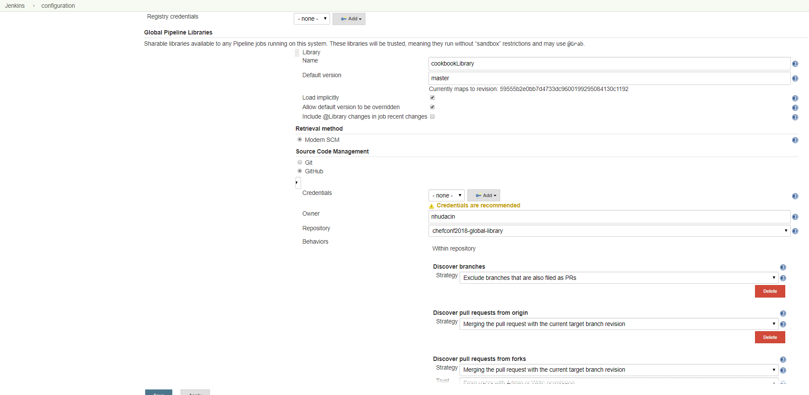

# global_library_demo

Hello ChefConf 2018!

Demo Jenkins global library. 


### Setup

To use this global libary in Jenkins

1. Fork this repo (so you can update it)

2. Update the `notifyStash` block in [vars/cookbookWorkflow.groovy](vars/cookbookWorkflow.groovy) with your credentiad ID to use for notifyStash and the URL to BitBucket server. 

3. Configure Jenkins to load the global library (Manage Jenkins >> Configure System >> Add Global Pipeline Library)

      *WATCH OUT!*

      * The screen shot below imports the old library name. It should _not_ be "cookbookLibrary" it should be "global_lbrary_demo". 



4. Import the library in a cookbook!

```
// @Library('global_library_demo') _ // loads default config
// @Library('global_library_demo@branch_name') _ // loads library at a specific branch
// @Library('global_library_demo@v1.0') _ // loads library at a specific tag

@Library('global_library_demo@master') _

cookbookWorkflow {
}

```


### Additional Reading

* https://jenkins.io/doc/book/pipeline/shared-libraries/

* https://jenkins.io/blog/2017/06/27/speaker-blog-SAS-jenkins-world/


AWESOME EXAMPLES HERE: 

* https://github.com/fabric8io/jenkins-pipeline-library

